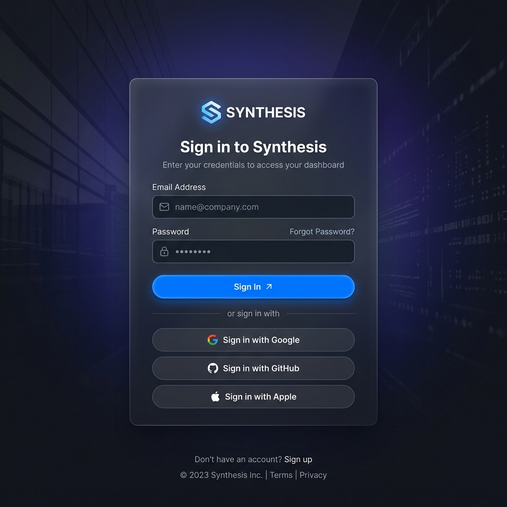
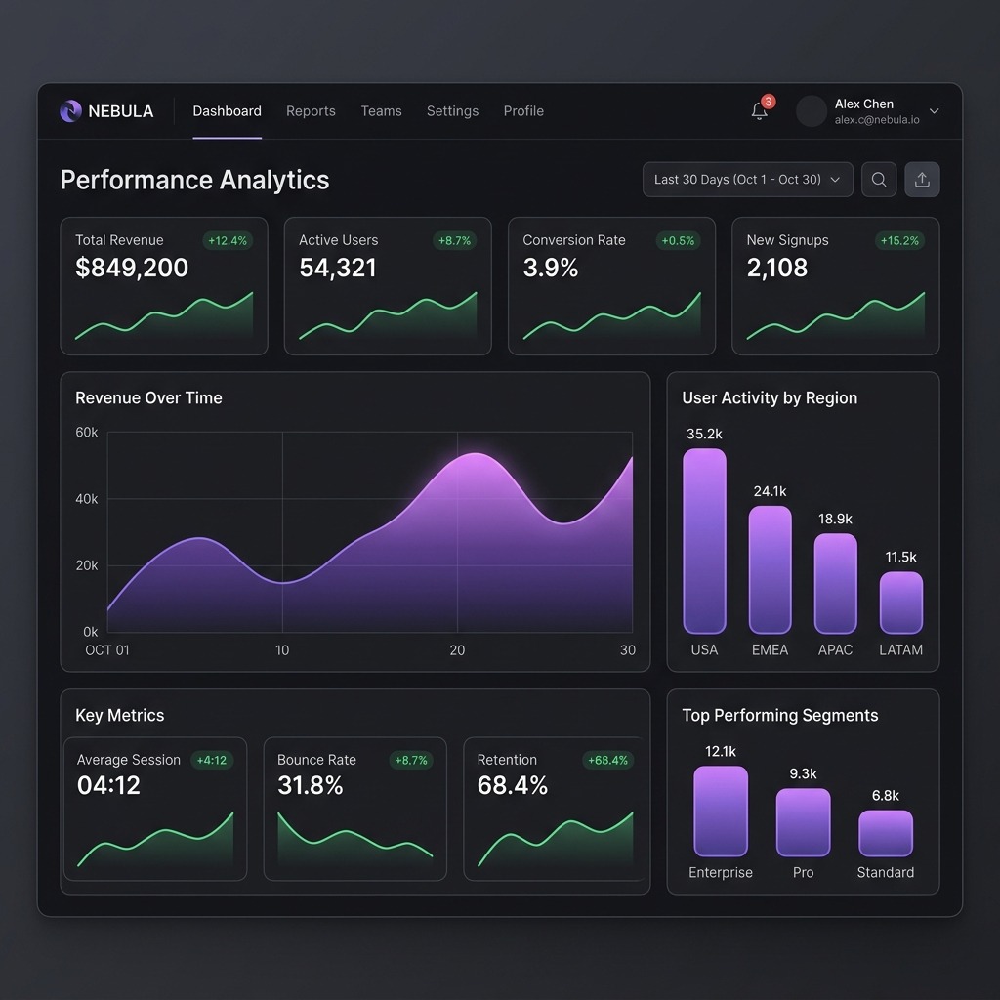
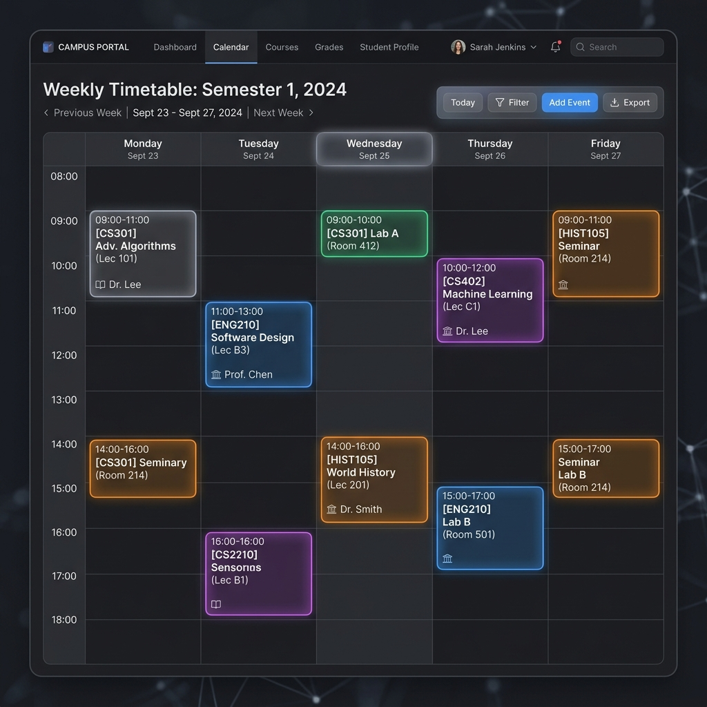
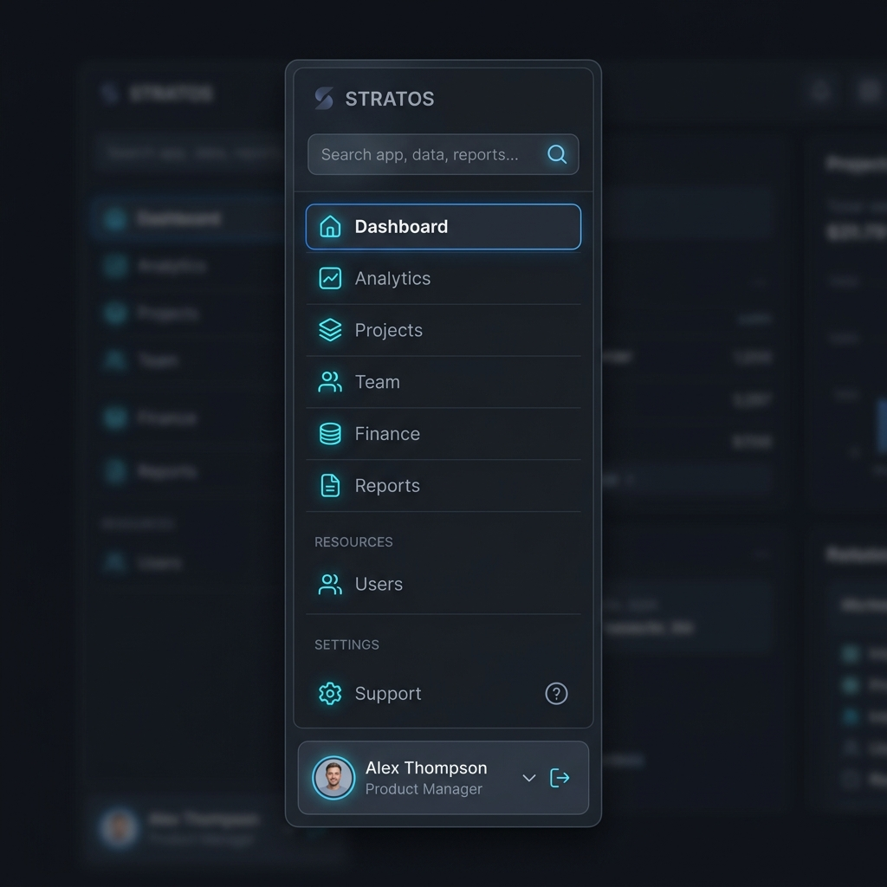

# Smart Campus Scheduling System

An enterprise-grade SaaS platform designed to streamline university operations, manage academic resources, and automatically resolve complex timetable scheduling conflicts.

## 📸 Previews

### 1. Premium Login Experience

*A sleek, dark-mode authentication portal featuring glassmorphism and subtle radial lighting.*

### 2. HOD / Admin Dashboard

*A polished analytics dashboard displaying campus network load and room utilization.*

### 3. Smart Scheduling Workspace

*The core engine interface for drafting, validating, and publishing conflict-free university timetables.*

### 4. Role-Based Navigation

*Clean, minimalist sidebar navigation tailored dynamically to Admins, HODs, Faculty, and Students.*

---

## 💻 Technologies Used

This flagship portfolio project is built using a modern, high-performance, and type-safe technology stack:

### Frontend
- **Framework**: Next.js 16 (App Router)
- **Library**: React 19
- **Styling**: Tailwind CSS v4
- **Animations**: Framer Motion (Complex SVG animations & page transitions)
- **Data Visualization**: Recharts
- **State Management**: Zustand
- **Forms & Validation**: React Hook Form + Zod
- **Icons**: Lucide React

### Backend
- **Framework**: NestJS
- **Database**: PostgreSQL
- **ORM**: Prisma
- **Authentication**: Passport.js with JWT Strategy
- **Security**: Bcrypt (Password Hashing), Helmet, CORS
- **File Processing**: Multer (Excel Imports)

---

## 🎯 Why I Created This

I engineered the Smart Campus Scheduling System to solve one of the most notoriously difficult logistical challenges in higher education: **academic scheduling**. 

Traditional universities often rely on fragmented spreadsheets and manual entry, leading to overlapping classes, double-booked rooms, and frustrated faculty. I built this platform to demonstrate how a complex business problem can be solved through clean software architecture.

Beyond the algorithmic challenge of conflict resolution, my goal was to elevate the user experience. Most university portals look outdated and feel sluggish. I intentionally designed this project with a premium, SaaS-level aesthetic. I wanted to prove that enterprise software can be both incredibly powerful behind the scenes and beautifully polished on the surface.
